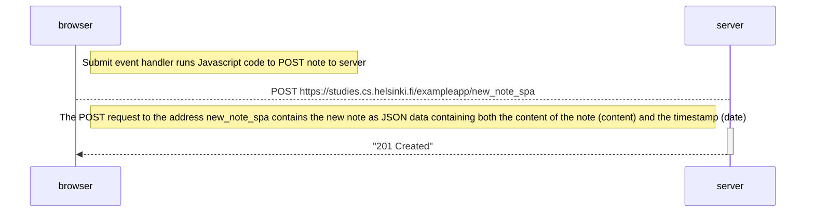

```mermaid
sequenceDiagram

participant browser
participant server

    Note right of browser: Submit event handler runs Javascript code to POST note to server
    browser-->server: POST https://studies.cs.helsinki.fi/exampleapp/new_note_spa
    Note right of browser: The POST request to the address new_note_spa contains the new note as JSON data containing both the content of the note (content) and the timestamp (date)
    activate server
    server-->>browser: "201 Created"
    deactivate server

 

```
