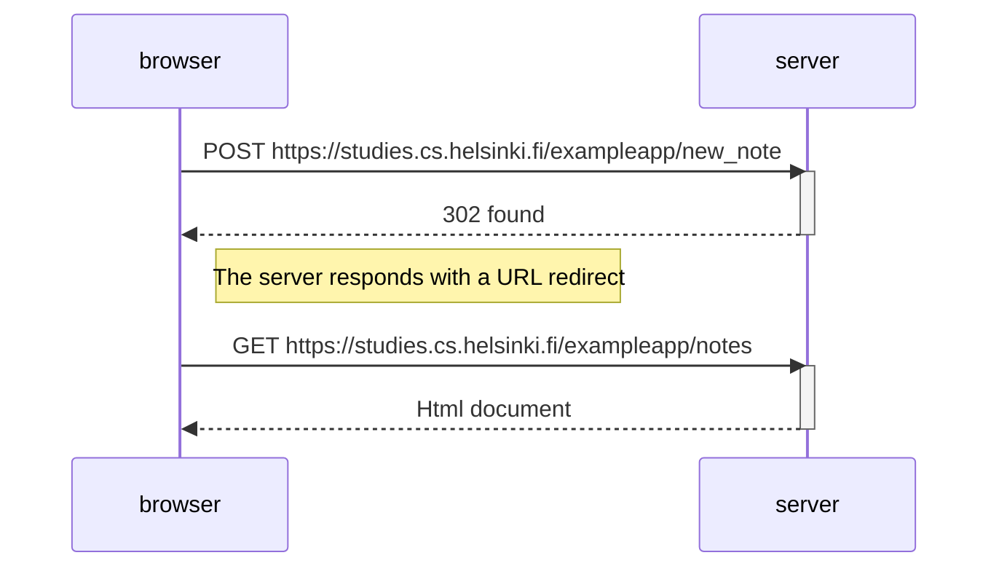

# a mermaid diagram for fullstackopen

```mermaid
sequenceDiagram
    participant browser
    participant server

    browser->>server: POST https://studies.cs.helsinki.fi/exampleapp/new_note
    activate server
    server-->>browser: 302 found
    deactivate server
    Note right of browser: The server responds with a URL redirect

    browser->>server: GET https://studies.cs.helsinki.fi/exampleapp/notes
    activate server
    server-->>browser: Html document
    deactivate server
```
